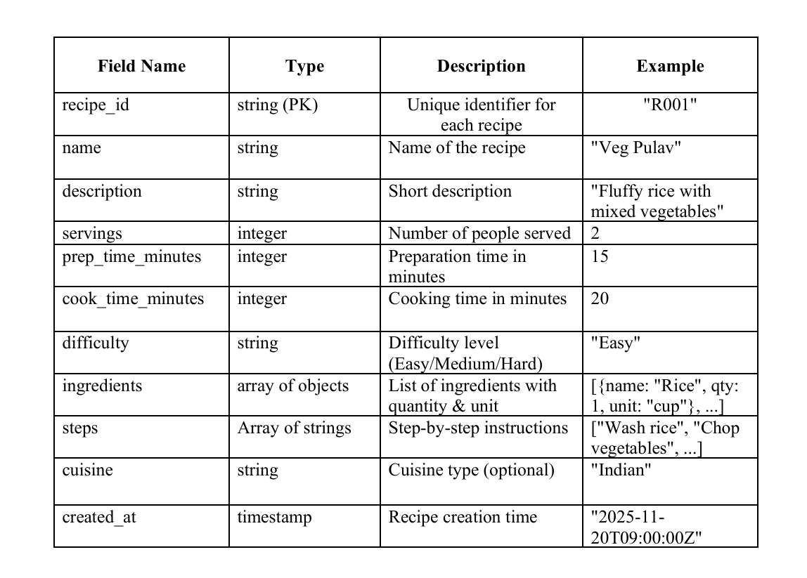
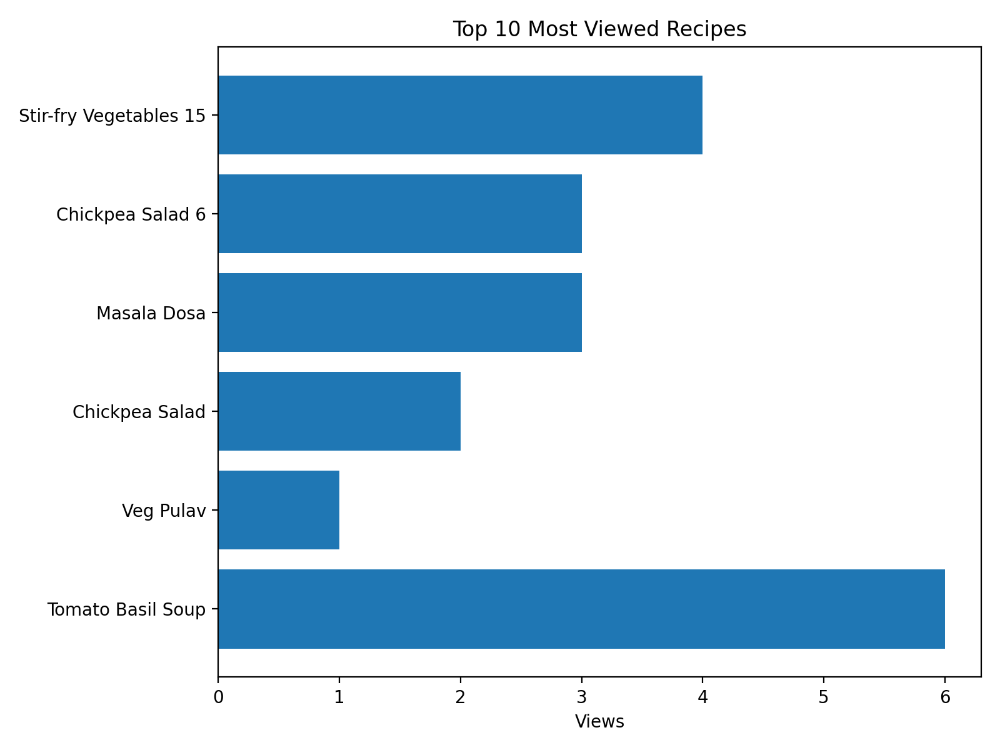
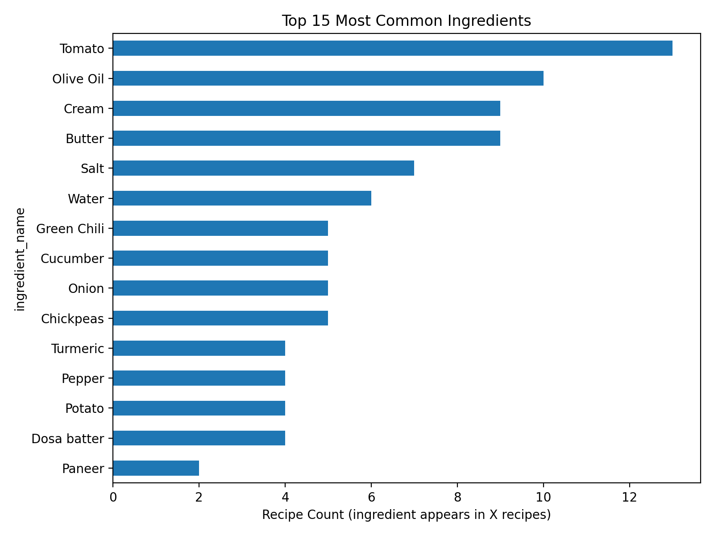
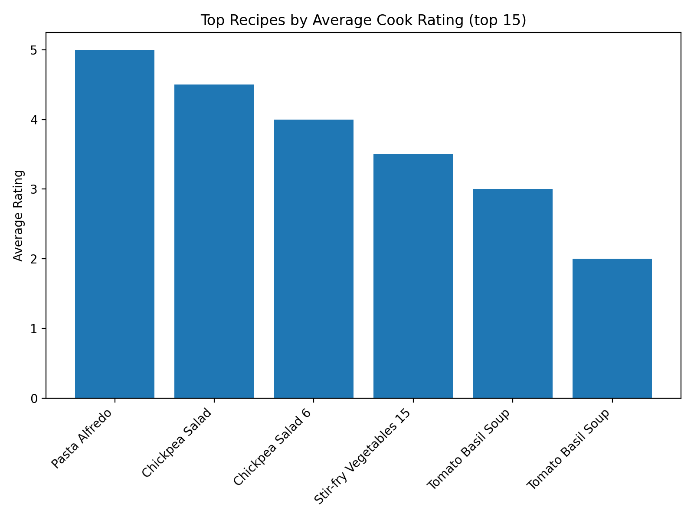
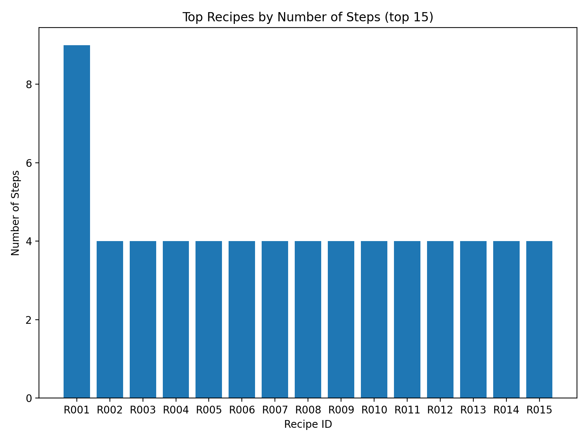
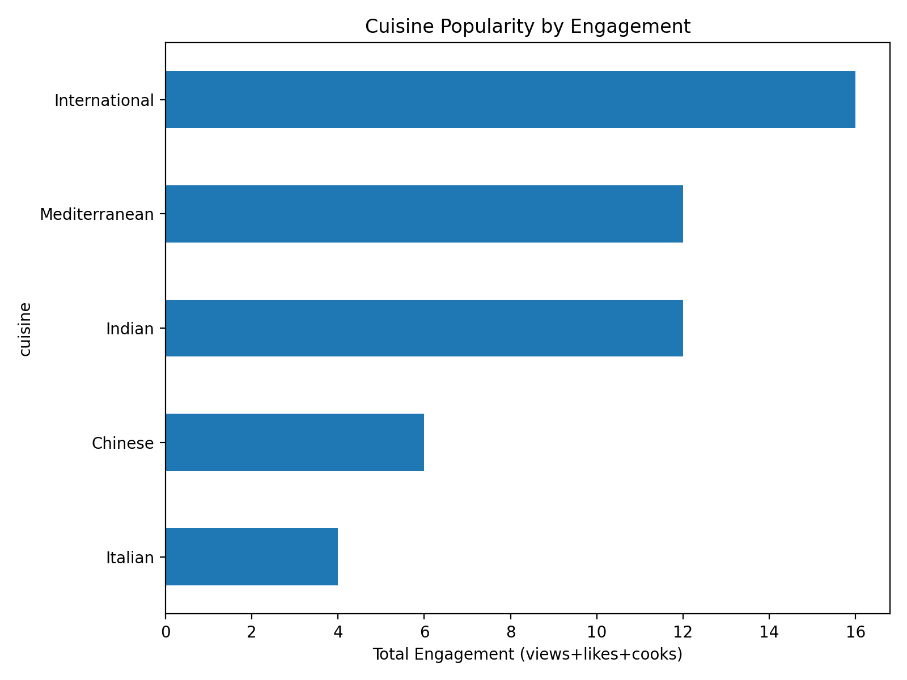

# Firebase-Based Recipe Analytics Pipeline

This project is a complete **recipe management and analytics pipeline** using **Firebase Firestore**, Python, and Pandas.  
It allows you to:

- Add recipes, users, and interactions  
- Validate the data  
- Perform analytics  
- Generate insights with a clean ETL process  

---

## Table of Contents

1. [Data Model](#data-model)  
2. [Pipeline Instructions](#pipeline-instructions)  
3. [ETL Process Overview](#etl-process-overview)  
4. [Analytics & Insights](#analytics--insights)  
5. [Visualization](#visualization)  
6. [Known Limitations](#known-limitations)  
7. [Future Enhancements](#future-enhancements)  

---

## 1. Data Model

The data model efficiently captures **recipes, users, and interactions** for analytics, validation, and ETL processing.

### A. Recipes Collection

Stores details of each recipe. Each recipe has a **unique `recipe_id`**.

**Fields:**

- `name`: Name of the recipe  
- `description`: Short description  
- `servings`: Number of servings  
- `prep_time_minutes` & `cook_time_minutes`: Cooking times  
- `difficulty`: Difficulty level (Easy, Medium, Hard)  
- `cuisine`: Cuisine type (e.g., Indian, Italian, Chinese)  
- `ingredients`: Array of objects (`name`, `qty_numeric`, `unit`, `qty_text`)  
- `steps`: Array of objects (`step_order`, `step_text`)  
- `created_at`: Timestamp  

**Example:**
```
{
  "recipe_id": "R001",
  "name": "Veg Pulav",
  "description": "Fluffy rice with vegetables and spices.",
  "servings": 2,
  "prep_time_minutes": 15,
  "cook_time_minutes": 20,
  "difficulty": "Easy",
  "ingredients": [
    {"name": "Rice", "qty_numeric": 1.0, "unit": "cup", "qty_text": ""},
    {"name": "Water", "qty_numeric": 3.5, "unit": "cups", "qty_text": ""}
  ],
  "steps": [
    {"step_order": 1, "step_text": "Rinse rice under running water."},
    {"step_order": 2, "step_text": "Chop vegetables."}
  ],
  "cuisine": "Indian",
  "created_at": "2025-11-20T06:00:00Z"
}
```
Schema Image:




### B. Users Collection

Stores information about registered users.

**Fields:**

- user_id: Unique identifier  
- `name`: User’s name  
- `email`: User’s email  
- `joined_at`: Timestamp  

**Example:**

```
{
  "user_id": "U001",
  "name": "Janhavi",
  "email": "janhavi@example.com",
  "joined_at": "2025-11-20T06:00:00Z"
}
```
Schema Image:


### C. UserInteractions Collection

Records how users interact with recipes.

**Fields:**

- `interaction_id`: Unique ID for interaction  
- `user_id`: References Users collection  
- `recipe_id`: References Recipes collection  
- `type`: Interaction type (view, like, cook)  
- `rating`: Numeric rating (only for cook interactions, 1–5)  
- `timestamp`: Interaction timestamp  

**Example:**

```
{
  "interaction_id": "I0001",
  "user_id": "U003",
  "recipe_id": "R016",
  "type": "view",
  "rating": null,
  "timestamp": "2025-11-20T06:05:00Z"
}
```
Schema Image:


## 2. Pipeline Instructions

Follow these step-by-step instructions to set up and run the project.

### Step 1: Install Dependencies

pip install firebase-admin pandas

### Step 2: Set Up Firebase
1. Create a Firebase project at [Firebase Console](https://console.firebase.google.com/).  
2. Enable Firestore database in the project.  
3. Download the service account key JSON file.  
4. Place `serviceAccountKey.json` in the project root directory.  

### Step 3: Upload Data 
#### ETL Pipeline Files Overview

### 1. `insert_data.py` – Data Insertion Script

**Purpose:**  
Handles inserting new data into Firestore.

**What it does:**

- **Insert Recipes:**  
  Uploads the seed recipe **Veg Pulav** and 19 synthetic recipes into the `Recipes` collection.  
  Fields include: `recipe_id`, `name`, `ingredients`, `steps`, `cuisine`, `prep_time_minutes`, `cook_time_minutes`, `difficulty`, `servings`, `created_at`.

- **Add Users:**  
  Adds 5 unique users to the `Users` collection.  
  Fields include: `user_id`, `name`, `email`, `joined_at`.

- **Generate User Interactions:**  
  Creates 50 interactions in `UserInteractions` collection.  
  Types: `view`, `like`, `cook` (with optional rating).

**When to run:**  
Use `insert_data.py` when you want to **populate Firestore with initial or synthetic data**.

---

### 2: Run the Entire Pipeline Using Docker

Instead of running multiple scripts manually, you can now run *all ETL, validation, and analytics tasks* inside a Docker container with a single command. The container is configured to execute the full pipeline automatically.


# Running the Entire Pipeline Using Docker

Instead of running multiple scripts manually, you can now run all ETL, validation, and analytics tasks inside a Docker container with a single command. The container is configured to execute the full pipeline automatically.

## A. Build the Docker Image

From the project root directory, run:

docker build -t recipe-pipeline .

This builds a Docker image containing:

- Python 3.11 environment
- Required packages: `pandas`, `firebase-admin`, `numpy`, `matplotlib`, `python-dateutil`
- Cron configured to run ETL & analytics periodically
- All project files inside `/app`

## B. Run the Docker Container

Run the following command to start the container:

docker run -d --name recipe_pipeline_container \
    -v C:\Users\eZee\Desktop\firebase_recipe_pipeline\Project\output_csv:/app/Project/output_csv \
    -v C:\Users\eZee\Desktop\firebase_recipe_pipeline\Project\analytics:/app/Project/analytics \
    -v C:\Users\eZee\Desktop\firebase_recipe_pipeline\Project\logs:/app/logs \
    recipe-pipeline

# What Happens When You Run This Command

## Container Setup
- Mounts local folders (`output_csv`, `analytics`, `logs`) to `/app` inside the container.  
- Ensures all generated CSVs, reports, and logs persist on your host machine.

## ETL Execution
- Runs `export_firestore.py` → extracts Firestore collections into JSON.  
- Runs `transform_etl.py` → converts JSON into structured CSVs (`recipe.csv`, `ingredients.csv`, `steps.csv`, `interactions.csv`).

## Validation
- Runs `validator.py` → checks for missing or invalid data.  
- Generates `validation_report.json`.

## Analytics
- Runs `analytics.py` → computes key insights:  
  - Most common ingredients  
  - Prep time vs likes correlation  
  - Difficulty distribution  
  - Most viewed recipes  
  - Engagement metrics, etc.

## Logging
- All output and errors are written to `logs/logs.txt`.  

Monitor logs with:


docker logs -f recipe_pipeline_container

## Cron Jobs
- The container is configured to automatically rerun the pipeline every 6 hours.  
- Cron runs in the foreground to keep the container alive.

## Stop the Container
- Stop the container if you don’t want the pipeline running temporarily:
  
docker stop recipe_pipeline_container

- The container will stop, and cron jobs will not run until restarted.

## Restart the Container
- Restart the container to resume scheduled ETL & analytics:

docker start -a recipe_pipeline_container

- The container will resume execution, and cron jobs will continue running every 6 hours.

## 3. ETL Process Overview

The ETL (Extract, Transform, Load) process cleans, validates, and loads recipe data from JSON files into Firestore.

### 3.1 Extract
- Reads JSON files: `recipes.json`, `users.json`, `user_interactions.json`
- Loads them into Python objects or Pandas DataFrames
- DataFrames allow easy filtering, manipulation, and analysis

### 3.2 Transform

#### Schema Validation
- Required fields present (`recipe_id`, `user_id`, `ingredients`)
- Field types consistent (`qty_numeric` numeric, `prep_time_minutes` integer)
- Ratings only for cook interactions
- Steps are correctly ordered

#### Data Cleaning
- `qty_numeric` missing → set as null
- Null ratings allowed for non-cook interactions
- Units and numeric quantities standardized

#### Standardization
- Normalize `rating` and `qty_numeric`
- Ensures uniform format for analytics

### 3.3 Load
- Uploads data into Firestore collections:
  - `Recipes`
  - `Users`
  - `UserInteractions`
- Data is now ready for querying, analytics, and visualization

## 4. Analytics & Insights

Provides 10 key insights:

- Most common ingredients across recipes
- Average preparation and cook times
- Difficulty distribution (Easy, Medium, Hard)
- Correlation between prep time and likes
- Most frequently viewed recipes
- Ingredients associated with high engagement
- Average rating of recipes cooked by users
- Users with highest interactions
- Recipes with highest total interactions
- Cuisine popularity based on engagement

## 5. Known Limitations

- **Synthetic Data:** Mostly synthetic for testing purposes
- **Rating Field Limitations:** Ratings exist only for cook interactions
- **Quantity Fields Optional:** `qty_numeric` may be missing
- **Overwriting Firestore Data:** ETL runs may overwrite existing documents
- **Dependency on CSVs:** Required in `task3_output`
- **Memory & Performance:** Large datasets may need optimization
- **Limited User Base:** Only 5 users; real-world projects require more dynamic users

## 6. Visualization

This module generates multiple charts that help visualize recipe data, user engagement, and overall trends.
All charts are produced using the visualize.py script and saved automatically inside the following folder:

- Project/visuals/

##### How to Run
Run the visualization script:

- python visualize.py

This reads the CSV files generated during the ETL process and creates the charts listed below.

### Charts Generated

The following visualizations are generated as PNG files:

### 1. Most Viewed Recipes

File: most_viewed_recipes.png

- This chart displays the recipes with the highest number of views.
- It helps identify which recipes users are most frequently checking.
- The data is shown in a horizontal bar chart.




### 2. Difficulty Distribution

File: difficulty_distribution.png

- This pie chart shows the proportion of recipes categorized as Easy, Medium, and Hard.
- It provides an understanding of the overall difficulty mix in the dataset.


### 3. Most Common Ingredients

File: most_common_ingredients.png

- This horizontal bar chart highlights the top 15 most frequently used ingredients across all recipes.
- It helps identify popular ingredients that appear repeatedly in the dataset.




### 4. Prep Time vs Likes

File: prep_time_vs_likes.png

- Displays a scatter plot showing the relationship between preparation time and the number of likes a recipe receives.
- A trendline is included (when possible) to show correlation direction.
- Useful for understanding if shorter or longer prep times affect recipe popularity.


### 5. Top Recipes by Total Interactions

File: top_recipes_total_interactions.png

Shows the recipes with the highest combined engagement based on:

- views

- likes

- cook interactions

Displayed as a horizontal bar chart.
This chart helps identify the most overall popular recipes.


### 6. Average Rating per Recipe

File: average_rating_per_recipe.png

- This chart presents the average rating for recipes that have cook interactions with ratings (1–5).
- Only the top 15 highest-rated recipes are shown.
- Helps identify highly rated recipes based on cooking experience.




## 7. Recipes with Most Steps

File: avg_steps_per_recipe.png

- Shows which recipes have the highest number of total steps.
- Displayed as a vertical bar chart.
- Useful for understanding which recipes are more complex or detailed.




## 8. Cuisine Popularity by Engagement

File: cuisine_popularity_engagement.png

- This visualization shows engagement levels (views + likes + cooks) grouped by cuisine.
- Helps understand which cuisines are generating the most user interest.
- Displayed as a horizontal bar chart.




## 7. Future Enhancements

- Add real user data instead of synthetic data
- Support dynamic recipe addition via web interface
- Implement recommendation engine for personalized recipes
- Add advanced analytics dashboards


