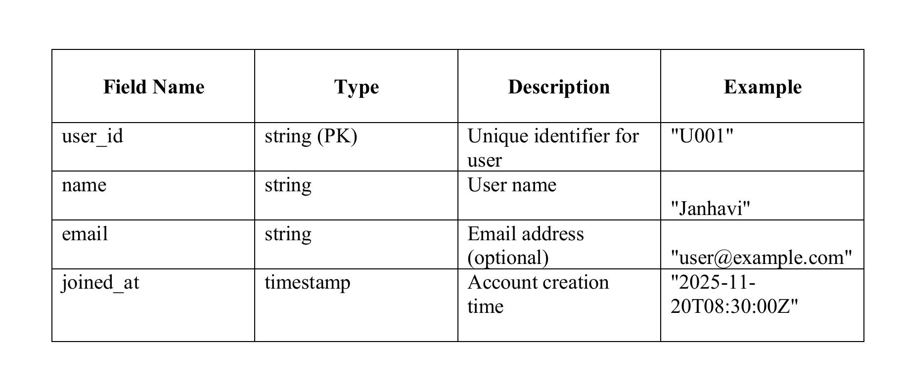
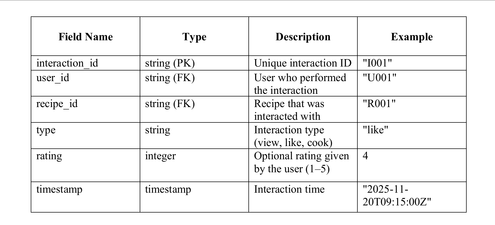

1. Explanation of the Data Model

The data model is designed to capture recipes, users, and interactions efficiently, allowing analytics, validation, and ETL processing.

Entities and Fields:

A. Recipes Collection

Stores details of each recipe.
Each recipe document has a unique recipe_id (Primary Key).

Fields:

name: Name of the recipe.

description: Short description of the recipe.

servings: Number of servings.

prep_time_minutes & cook_time_minutes: Cooking times.

difficulty: Difficulty level (Easy, Medium, Hard).

cuisine: Cuisine type (e.g., Indian, Italian, Chinese).

ingredients: Array of objects (name, qty, unit).

steps: Array of strings (ordered cooking steps).

created_at: Timestamp when recipe was added.

Example:

{
  "recipe_id": "R001",
  "name": "Veg Pulav",
  "description": "Fluffy rice with vegetables and spices.",
  "servings": 2,
  "prep_time_minutes": 15,
  "cook_time_minutes": 20,
  "difficulty": "Easy",
  "ingredients": [
    {"name": "Rice", "qty_numeric": 1.0, "unit": "cup", "qty_text": ""},
    {"name": "Water", "qty_numeric": 3.5, "unit": "cups", "qty_text": ""}
  ],
  "steps": [
    {"step_order": 1, "step_text": "Rinse rice under running water."},
    {"step_order": 2, "step_text": "Chop vegetables."}
  ],
  "cuisine": "Indian",
  "created_at": "2025-11-20T06:00:00Z"
}

following is the schema for Recipes collection:

B. Users Collection 
Stores information about registered users.

Fields:

user_id: Unique identifier for each user.

name: User’s name.

email: User’s email.

joined_at: Timestamp when user joined. 

Example:

{
  "user_id": "U001",
  "name": "Janhavi",
  "email": "janhavi@example.com",
  "joined_at": "2025-11-20T06:00:00Z"
}

following is the schema for Users collection:

C. UserInteractions Collection 
Records how users interact with recipes.

Fields:

interaction_id: Unique ID for interaction.

user_id: References Users collection.

recipe_id: References Recipes collection.

type: Interaction type (view, like, cook).

rating: Numeric rating (only for cook interactions, 1–5).

timestamp: Interaction timestamp.

Example:

{
  "interaction_id": "I0001",
  "user_id": "U003",
  "recipe_id": "R016",
  "type": "view",
  "rating": null,
  "timestamp": "2025-11-20T06:05:00Z"
}

following is the schema for Users collection:

2. Instructions for Running the Pipeline

Install dependencies:
pip install firebase-admin pandas

Set up Firebase
Place your serviceAccountKey.json in the project root.
Ensure Firestore database is enabled in your Firebase project.

Upload data (Task 2)

python main.py

Inserts Veg Pulav + 19 synthetic recipes.

Adds 5 users.

Generates 50 user interactions.

Run validation (Task 3)

python task3_output/validate_data.py

Generates validation_report.json with valid and invalid records.

Run analytics (Task 5)

python task3_output/analytics.py

Produces insights like:

Most common ingredients

Average prep and cook time

Difficulty distribution

Correlation between prep time and likes

Most frequently viewed recipes

Ingredients associated with high engagement

3. ETL Process Overview

The ETL (Extract, Transform, Load) process in this pipeline is designed to clean, validate, and load recipe data from JSON files into Firestore for analytics and querying. Here’s a detailed explanation of each step:

* Extract :

The pipeline first reads the raw JSON files:

recipes.json – contains all recipes (Veg Pulav + synthetic recipes).

users.json – contains all user records.

user_interactions.json – contains interactions like view, like, or cook.

These JSON files are loaded into Python objects and/or Pandas DataFrames.

Using DataFrames allows easy manipulation, filtering, and analysis.

This step ensures all data is loaded into memory in a structured form ready for transformation.

* Transform :

Schema Validation: Using validate_data.py, the pipeline checks:

Required fields are present (e.g., recipe_id, user_id, ingredients).

Field types are consistent (e.g., numeric values for qty_numeric, integers for prep_time_minutes).

Ratings are only present for cook interactions; other types (view/like) must have null.

Steps are correctly ordered and formatted.

Data Cleaning:

Missing or inconsistent values are handled. For example:

If qty_numeric is missing, it is set as null.

Null ratings for non-cook interactions are allowed.

Units and numeric quantities are standardized for consistent analytics.

Standardization:

Fields like rating and qty_numeric are normalized to ensure calculations in analytics are accurate.

Ensures recipes, users, and interactions are in a uniform format before insertion.

* Load :

After validation and cleaning, the pipeline uploads data into Firestore:

Recipes collection: stores all recipe documents.

Users collection: stores all user documents.

UserInteractions collection: stores all interaction documents.

The loaded data is now ready for querying, analytics, and visualization.

This step ensures that Firestore always contains consistent, clean, and structured data.

4. Insights Summary (Task 5)

The analytics module (analytics.py) provides at least 10 key insights to understand recipe trends, user engagement, and ingredient popularity. Here’s a detailed breakdown:

Most Common Ingredients Across Recipes:
Identifies which ingredients appear most frequently across all recipes.
Helps understand core ingredients in your dataset.
Average Preparation and Cook Times
Calculates the mean prep time (prep_time_minutes) and cook time (cook_time_minutes) for all recipes.
Useful for estimating overall cooking effort for users.
Difficulty Distribution of Recipes
Counts recipes per difficulty level (Easy, Medium, Hard).
Shows which difficulty level is most common.
Correlation Between Prep Time and Number of Likes
Analyzes whether longer or shorter prep times influence user likes.
Determines if users prefer quick recipes or are willing to try complex recipes.
Most Frequently Viewed Recipes
Finds recipes with the highest number of view interactions.
Highlights recipes that attract the most attention.
Ingredients Associated with High Engagement
Finds ingredients that appear in recipes with the most likes or cooks.
Helps identify “popular” ingredients driving user engagement.
Average Rating of Recipes Cooked by Users
Computes the mean rating for recipes cooked by users.
Provides insight into which recipes are most appreciated by users.
Users with Highest Interactions
Identifies the most active users by counting total interactions (view, like, cook).
Useful for understanding user behavior and engagement patterns.
Recipes with Highest Total Interactions
Counts total interactions per recipe.
Highlights the recipes that are both popular and frequently cooked or liked.
Cuisine Popularity Based on Engagement Metrics
Analyzes which cuisines have the highest engagement.
Engagement metrics can include total views, likes, or average cook ratings.

Summary: These insights allow the project team to identify trends in recipe usage, popular ingredients, and user behavior patterns. They also provide data-driven guidance for future recipe recommendations or marketing strategies.

5. Known Constraints / Limitations

The current pipeline has some limitations to be aware of:

Synthetic Data:

Task 1 JSON files are mostly synthetic for testing purposes.

They may not cover all real-world scenarios or represent actual cooking behavior.

Rating Field Limitations:

Ratings exist only for cook interactions.

view and like interactions have null ratings, so analytics cannot analyze ratings for all interactions.

Quantity Fields Optional:

qty_numeric in ingredients is optional.

Missing values may affect calculations like total ingredient usage.

Overwriting Firestore Data:

The ETL currently uploads all recipes and interactions each time.

Existing documents in Firestore may be overwritten on repeated runs.

Dependency on CSVs for Analytics:

Analytics scripts require CSVs in task3_output.

If CSVs are missing or corrupted, analytics will fail.

Memory & Performance Considerations:

Large datasets may need optimization.

Pandas and JSON parsing may consume a lot of memory for very large datasets.

Limited User Base:

Only 5 users are generated; real-world usage would require a dynamic and larger user base.